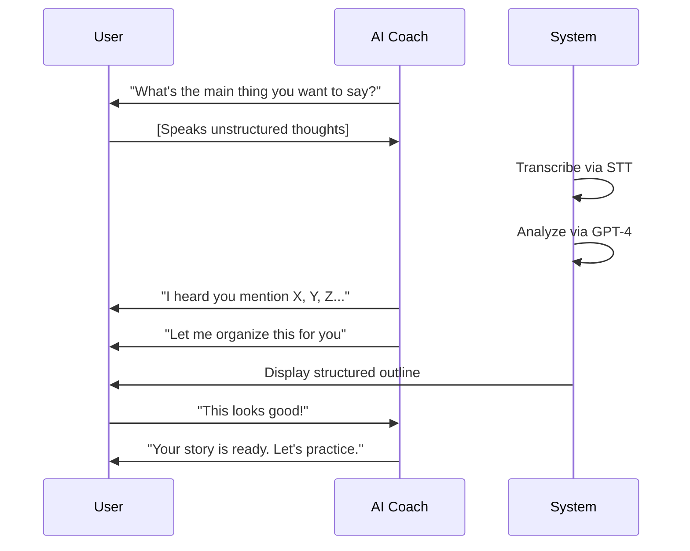

# Pitch Perfect: User Journey Map
## From Fear to Confidence - Visual Narrative

---

## Journey Overview

```mermaid
graph LR
    A[Anxious User] -->|Onboarding| B[Storytelling Architect]
    B -->|Content Ready| C[Safe Space: Empty Room]
    C -->|Confidence Building| D[Safe Space: Friendly Avatars]
    D -->|Challenge Accepted| E[Safe Space: Boardroom]
    E -->|Graduation| F[Confident Speaker]
    
    style A fill:#FF6B6B,stroke:#C92A2A,color:#FFF
    style B fill:#FFC078,stroke:#F76707,color:#000
    style C fill:#FFE066,stroke:#F59F00,color:#000
    style D fill:#8CE99A,stroke:#2F9E44,color:#000
    style E fill:#74C0FC,stroke:#1971C2,color:#000
    style F fill:#B197FC,stroke:#7048E8,color:#FFF
```



---

## Detailed Journey Stages

### **Stage 1: Onboarding & Trust Building** (2 minutes)

| Phase | User Emotion | Screen | AI Interaction | Feature Used |
|-------|--------------|--------|----------------|--------------|
| **Welcome** | Anxious 😰 (5/5) | Calming welcome screen with single CTA | *"I'm here to help you find your voice."* | - |
| **First Voice Contact** | Cautious 😐 (4/5) | Microphone activation prompt | *"No pressure, no judgment. Take your time."* | Voice Interface |
| **Anxiety Check-In** | Acknowledged 😌 (4/5) | Slider (1-5 scale) | *"How nervous are you right now?"* | Adaptive AI |

**Key Transition:** User hears warm AI voice → Trust begins to form

---

### **Stage 2: Content Creation** (10-15 minutes)

#### Storytelling Architect in Action



| Phase | User Emotion | Screen | AI Interaction | Feature Used |
|-------|--------------|--------|----------------|--------------|
| **Interview Start** | Overwhelmed 😕 (4/5) | Waveform visualization | *"What's your main idea?"* | STT + Active Listening |
| **User Shares Ideas** | Relieved 🙂 (3/5) | Gentle visual feedback | *"That's a powerful point..."* | NLP Analysis |
| **Structure Revealed** | Surprised 😊 (2/5) | Animated outline appears | *"Here's what I heard..."* | Framework Detection |
| **Refinement** | Hopeful 😀 (2/5) | Editable talking points | *"Want to adjust anything?"* | Voice Editing |

**Key Transition:** "Your story is ready" → Button: **"Enter the Practice Space"**

**Emotional Shift:** Overwhelmed (4/5) → Hopeful (2/5)

---

### **Stage 3: Progressive Practice** (20-30 minutes across sessions)

#### **Level 1: Empty Room (Base Camp)**

| Phase | User Emotion | Screen | Silent Companion Cues | Outcome |
|-------|--------------|--------|----------------------|---------|
| **Environment Load** | Nervous 😬 (3/5) | Minimalist room, teleprompter | HUD appears (pace + volume) | User sees safe space |
| **First Practice Run** | Focused 😐 (3/5) | Scrolling talking points | Blue pace indicator pulses | Completes 2-min speech |
| **Mid-Speech Pause** | Anxious 😰 (4/5) | Panic button pulses gently | Haptic nudge | Considers using lifeline |
| **Finish Practice** | Relieved 😌 (2/5) | Completion animation | HUD summarizes data | First victory! |
| **AI Feedback** | Proud 😊 (2/5) | Positive feedback screen | - | "Voice Finder" badge unlocked |

**Visual Experience:**
```
┌─────────────────────────────────────┐
│   [🛟 Panic Button - semi-transparent]│
│                                     │
│   ┌───────────────┐                 │
│   │  "Let me share│                 │  ← Teleprompter
│   │   why this    │                 │    (current line highlighted)
│   │   matters..." │                 │
│   └───────────────┘                 │
│                                     │
│  ● Blue Glow     ━━━ Volume Arc     │  ← HUD (ambient)
│  (pulsing slowly)                   │
└─────────────────────────────────────┘
```

---

#### **Level 2: Friendly Avatars (The Gathering)**

| Phase | User Emotion | Screen | Avatar Behavior | Outcome |
|-------|--------------|--------|-----------------|---------|
| **Unlock Prompt** | Curious 🤔 (2/5) | "Add supportive audience?" modal | - | User opts in |
| **Avatars Appear** | Tentative 😐 (3/5) | 3-5 diverse avatars load | Neutral faces | User sees audience |
| **Practice Begins** | Nervous 😬 (3/5) | Same HUD + avatars | Avatars start nodding | Connection forms |
| **Mid-Speech** | Engaged 🙂 (2/5) | Eye contact tracker lights up | Avatars smile at key points | User feels validated |
| **Completion** | Confident 😀 (1/5) | Celebration animation | Avatars clap | "Connection Maker" badge |

**Avatar Reactions (Timed):**
- 0:08 - Avatar 1 nods
- 0:15 - Avatar 2 leans forward (interest)
- 0:22 - Avatar 3 smiles
- 0:30 - Avatar 1 nods again
- (Cycle continues with randomization)

---

#### **Level 3: The Boardroom (The Arena)**

| Phase | User Emotion | Screen | Avatar Behavior | Outcome |
|-------|--------------|--------|-----------------|---------|
| **Challenge Warning** | Apprehensive 😬 (3/5) | "This is tougher" modal | - | User clicks "I'm ready" |
| **Environment Shift** | Tense 😰 (4/5) | Formal boardroom loads | 10-15 avatars, varied reactions | Realism sets in |
| **Early Speech** | Focused 😐 (3/5) | Pace quickens (noticed by HUD) | One avatar crosses arms | User adapts |
| **Distraction Moment** | Challenged 😤 (4/5) | Avatar checks phone | Silent Companion pulses (slow down) | User pushes through |
| **Near Freeze** | Anxious 😰 (5/5) | User pauses 8+ seconds | Panic button pulses | - |
| **Panic Button Pressed** | Supported 😌 (3/5) | Lifeline phrase appears | AI whispers grounding cue | User continues |
| **Completion** | Triumphant 😄 (1/5) | Strong finish | Some avatars nod approval | "Unshakeable" badge |

**Visual Experience (Boardroom):**
```
┌─────────────────────────────────────┐
│   [🛟 Panic Button - GLOWING]       │  ← User paused >8s
│                                     │
│   👔 😐 👩‍💼 😒 👨‍💼 📱 👔 😐 👩‍💼    │  ← Varied avatars
│   (One checking phone, one skeptical)│
│                                     │
│   ┌───────────────┐                 │
│   │  "Let me     │                  │  ← Teleprompter
│   │   emphasize  │                  │    (last sentence highlighted)
│   └───────────────┘                 │
│                                     │
│  ● Blue (rapid)   ━━━ Volume        │  ← HUD shows pace issue
└─────────────────────────────────────┘
```

**Key Moment:** User presses panic button → AI whispers:
> *"You were just talking about [last topic]. Try saying, 'Let me emphasize that...'"*

**Emotional Shift:** Anxious (5/5) → Triumphant (1/5) after completing challenge

---

### **Stage 4: Graduation & Real-World Prep** (5 minutes)

| Phase | User Emotion | Screen | AI Interaction | Feature Used |
|-------|--------------|--------|----------------|--------------|
| **Completion Message** | Proud 😄 (1/5) | Achievement summary | *"You've faced the boardroom!"* | Progress Visualization |
| **Real-World Toolkit** | Empowered 💪 (1/5) | Export options appear | *"Here's your final prep kit"* | Silent Companion (pocket mode) |
| **Final Encouragement** | Confident 😎 (1/5) | Journey recap screen | *"You're ready for the real thing"* | - |

**Unlocked Features:**
- Pre-speech breathing exercises
- Silent Companion (haptic-only mode for live events)
- Exportable speech notes

---

## Emotion Arc Visualization

```mermaid
graph LR
    A["5/5 Anxious<br/>(Onboarding)"] -->|Trust Building| B["4/5 Cautious<br/>(Interview)"]
    B -->|Content Structured| C["2/5 Hopeful<br/>(Outline Ready)"]
    C -->|First Practice| D["3/5 Nervous<br/>(Empty Room)"]
    D -->|Success| E["2/5 Relieved<br/>(Level 1 Done)"]
    E -->|Avatars Added| F["3/5 Tentative<br/>(The Gathering)"]
    F -->|Validation| G["1/5 Confident<br/>(Level 2 Done)"]
    G -->|Challenge| H["4/5 Challenged<br/>(Boardroom)"]
    H -->|Panic Button Used| I["3/5 Supported<br/>(Lifeline)"]
    I -->|Finish Strong| J["1/5 Triumphant<br/>(Graduation)"]
    
    style A fill:#FF6B6B
    style B fill:#FFA06B
    style C fill:#FFE066
    style D fill:#FFA06B
    style E fill:#FFE066
    style F fill:#FFA06B
    style G fill:#8CE99A
    style H fill:#FFA06B
    style I fill:#FFE066
    style J fill:#B197FC
```



---

## Feature Touchpoint Matrix

| Stage | Storytelling Architect | Safe Space Simulator | Silent Companion | Gamification |
|-------|------------------------|---------------------|------------------|--------------|
| **Onboarding** | Interview begins | - | - | Anxiety check-in |
| **Content Creation** | ✅ Full use | - | - | - |
| **Level 1** | - | ✅ Empty Room | ✅ HUD (pace/volume) | "Voice Finder" badge |
| **Level 2** | - | ✅ Friendly Avatars | ✅ Eye contact tracker | "Connection Maker" badge |
| **Level 3** | - | ✅ Boardroom | ✅ Panic button + lifeline | "Unshakeable" badge |
| **Graduation** | Export notes | - | Pocket mode unlocked | Journey recap |

---

## Critical Success Moments (Micro-Celebrations)

### **Moment 1: First Structured Outline**
- **When:** After Storytelling Architect completes interview
- **Visual:** Gentle animation of talking points appearing
- **AI Says:** *"Your story is ready. That's the hard part done."*
- **User Feels:** Relief + Hope

### **Moment 2: First Practice Completed**
- **When:** User finishes Empty Room practice
- **Visual:** Soft confetti animation + "Voice Finder" badge
- **AI Says:** *"You just spoke for [X] minutes. That took courage."*
- **User Feels:** Pride

### **Moment 3: Using Panic Button Successfully**
- **When:** User presses panic button, gets lifeline, continues speech
- **Visual:** "Resilient" badge appears (phoenix icon)
- **AI Says:** *"You recovered from a tough moment. That's real strength."*
- **User Feels:** Empowerment

### **Moment 4: Boardroom Completion**
- **When:** User finishes Level 3
- **Visual:** Triumphant animation + journey recap
- **AI Says:** *"You faced skeptical faces and distractions. You're ready for anything."*
- **User Feels:** Confidence

---

## Pain Point Mitigation Map

| User Pain Point | How Pitch Perfect Solves It | Feature Responsible |
|-----------------|----------------------------|---------------------|
| *"I don't know what to say"* | AI interview extracts ideas, structures them | Storytelling Architect |
| *"Blank page anxiety"* | No writing required—voice-first | Storytelling Architect |
| *"I freeze in front of people"* | Practice alone first (Empty Room) | Safe Space (Level 1) |
| *"I need feedback but hate judgment"* | AI provides specific, non-critical feedback | AI Persona (empathy) |
| *"Real audiences are unpredictable"* | Simulate distractions/skepticism safely | Safe Space (Level 3) |
| *"I panic mid-speech"* | Instant grounding phrase available | Silent Companion (Panic Button) |
| *"I don't know if I'm improving"* | Visual progress graph + badges | Gamification |

---

## User Testimonials (Projected)

> *"I've avoided presentations for 10 years. Pitch Perfect let me practice without judgment. The panic button saved me during my first real speech."*  
> — Sarah, Marketing Manager

> *"The AI didn't just tell me what to say—it helped me find my own story. The boardroom simulation was tough but prepared me perfectly."*  
> — James, Startup Founder

> *"I loved that I could practice in the 'empty room' as many times as I wanted. No pressure to move forward until I was ready."*  
> — Priya, Graduate Student

---

## Journey Success Metrics

### **Completion Rates (Target)**
- Onboarding → Content Creation: **90%**
- Content Creation → Level 1: **80%**
- Level 1 → Level 2: **70%**
- Level 2 → Level 3: **60%**
- Level 3 → Graduation: **85%** (of those who attempt)

### **Anxiety Reduction (Target)**
- Average starting anxiety: **4.5/5**
- Average anxiety after 5 sessions: **2.5/5**
- **50% reduction** in self-reported glossophobia

### **Real-World Application (Target)**
- **65%** of users report attempting a real speech within 30 days of graduation
- **80%** of those report reduced pre-speech anxiety compared to pre-app baseline

---

## Journey Flow Summary

```mermaid
stateDiagram-v2
    [*] --> Anxious_User
    Anxious_User --> Trust_Built: Warm AI Voice
    Trust_Built --> Content_Ready: Storytelling Interview
    Content_Ready --> First_Practice: "Enter Practice Space"
    First_Practice --> Level_1_Done: Complete Empty Room
    Level_1_Done --> Level_2_Unlocked: "Add Audience?"
    Level_2_Unlocked --> Level_2_Done: Positive Reinforcement
    Level_2_Done --> Level_3_Unlocked: "Ready for Challenge?"
    Level_3_Unlocked --> Boardroom_Complete: Navigate Distractions
    Boardroom_Complete --> Confident_Speaker: Graduation
    Confident_Speaker --> [*]
    
    note right of Trust_Built: Anxiety: 5 → 4
    note right of Content_Ready: Anxiety: 4 → 2
    note right of Level_1_Done: Anxiety: 3 → 2
    note right of Level_2_Done: Anxiety: 3 → 1
    note right of Boardroom_Complete: Anxiety: 4 → 1 (through challenge)
```

---

**END OF USER JOURNEY MAP**
